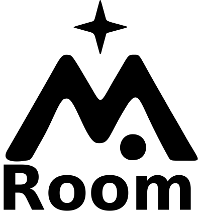

# Roomie

<p align="center">
  
</p>

<p align="center">
  Campañas de marketing hotelero hiper-personalizadas, diseñadas, enviadas y optimizadas por agentes de IA.
</p>

---

**Roomie** es una plataforma de marketing hotelero impulsada por IA. El usuario describe un objetivo de negocio en lenguaje natural — *"recuperar clientes inactivos del Eurostars Torre Sevilla"* — y Roomie ejecuta una cadena de cuatro agentes que segmenta clientes, define estrategia, redacta el email y audita el resultado. Si la calidad supera el umbral, la misma plataforma selecciona destinatarios, envía la campaña, mide aperturas/clics/conversiones y dispara follow-ups automáticos a quienes no abren, escalando la intensidad creativa en cada intento.

Proyecto desarrollado para el reto de **Eurostars Hotel Company** en el **[Impacthon 2026](https://impacthon-web.vercel.app)**.

## Qué hace

- **Pipeline creativo en 4 fases** — analista, estratega, creativo y auditor, ejecutado en background con polling progresivo en la UI.
- **Inteligencia de mercado real** — Open-Meteo (clima) + INE tempus3 (ocupación EOH y demanda turística FRONTUR), inyectada únicamente en los prompts del Analista y Estratega como evidencia, nunca como persuasión.
- **Envío con tracking real** — selección heurística de destinatarios, reescritura de enlaces para click-tracking, píxel de apertura, `List-Unsubscribe` RFC 8058 one-click y agregación de estadísticas en una sola query.
- **Follow-ups autónomos** — recurrencia configurable que regenera el creativo (no el audit) escalando agresividad y patrones de persuasión en cada intento, hasta que el destinatario abra, convierta o se desuscriba.
- **Refinamiento conversacional del creativo** — el usuario puede pedir cambios en lenguaje natural sobre el email ya generado (*"hazlo más cálido y menos comercial"*) y Roomie regenera el `body_html` reusando todo el contexto original.
- **API REST pública** bajo `/api/v1` con tokens Bearer auto-gestionados y webhooks salientes firmados con HMAC para integraciones externas.

## Pipeline de 4 agentes

| Agente | Función |
|--------|---------|
| **Analista** | Segmenta clientes, extrae insights y cruza con el contexto de mercado (clima + INE). |
| **Estratega** | Define público objetivo, hotel, canal y *timing* con justificación basada en datos. |
| **Creativo** | Redacta `subject_line`, preheader y `body_html` siguiendo una guía de diseño editorial fija. |
| **Auditor** | Revisa coherencia entre fases y emite un score 0-100 con veredicto final. |

Cada agente recibe el output del anterior como contexto. El proveedor LLM se elige por campaña: Anthropic Claude, Google Gemini, OpenAI, DeepSeek o cualquier endpoint compatible con la API de OpenAI (Together, Groq, Fireworks, modelos locales…) introduciendo `base URL` y modelo.

## Tech stack

- **Backend:** PHP 8.4 / Laravel 13
- **Frontend:** Blade + Tailwind CSS v4 + Vite
- **IA:** Anthropic, Google Gemini, OpenAI, DeepSeek y proveedores compatibles con OpenAI (BYOK)
- **Datos externos:** Open-Meteo (clima, sin clave) + INE tempus3 (EOH `2074` + FRONTUR `24304`)
- **Base de datos:** SQLite por defecto
- **Cola:** Database driver (pipeline + envío + follow-ups asíncronos)
- **Mail:** driver `log` por defecto, SMTP cuando se habilita el envío real
- **Testing:** Pest v4

## Instalación

```bash
git clone https://github.com/abrahampo1/roomie roomie
cd roomie

composer install
cp .env.example .env
php artisan key:generate

php artisan migrate --seed
npm install && npm run build
```

Roomie es **BYOK (bring your own key)**: cada usuario introduce su propia clave LLM al crear una campaña. La clave se cifra (cast `encrypted`) en la fila de la campaña y se conserva durante un máximo de 14 días para permitir follow-ups autónomos. Caduca antes si:

1. el usuario pulsa **Detener secuencia** desde la UI,
2. todos los destinatarios alcanzan un estado terminal (abierto, convertido o desuscrito), o
3. `campaigns:wipe-expired-keys` (cron horario) la elimina al pasar la ventana de retención.

El frontend cachea las claves en `localStorage` por proveedor (`roomie:llm-key:{provider}`) para no tener que pegarlas en cada campaña. **No hace falta configurar ninguna clave LLM en `.env`.**

## Desarrollo

```bash
composer run dev
```

Arranca concurrentemente el servidor de Laravel, el worker de colas, `pail` (logs en vivo) y Vite. Para que los follow-ups y la limpieza de claves se ejecuten en local, abre además otra terminal:

```bash
php artisan schedule:work
```

## Testing

```bash
composer test
# o un test concreto:
php artisan test --compact --filter=nombre_del_test
```

Después de tocar cualquier PHP, formatea con:

```bash
vendor/bin/pint --dirty --format agent
```

## Configuración crítica

| Variable | Valor por defecto | Para qué sirve |
|---|---|---|
| `ROOMIE_ALLOW_REAL_SENDS` | `false` | **Gate de seguridad.** Mientras esté en `false`, todo email se fuerza a través del mailer `log` aunque `MAIL_MAILER=smtp`. Combinado con los emails `@example.invalid` (RFC 2606) del seeder, el modo por defecto es doblemente seguro. Activar sólo con consentimiento de los destinatarios reales. |
| `ROOMIE_FOLLOWUP_MAX_RETENTION_DAYS` | `14` | Tope duro de cuántos días puede vivir la clave LLM cifrada en la fila de campaña para alimentar los follow-ups autónomos. |
| `MAIL_MAILER` | `log` | Driver de envío. Sólo se respeta cuando `ROOMIE_ALLOW_REAL_SENDS=true`. |

## Subsistemas

```
app/
  Http/Controllers/
    CampaignController.php           # CRUD del pipeline + refinamiento de creativo
    CampaignSendController.php       # Envío, stats, conversión manual, parada de follow-ups
    TrackingController.php           # Píxel de apertura, click-through y unsubscribe
    ApiTokenController.php           # Gestión de tokens Bearer del usuario
    WebhookSettingsController.php    # CRUD de webhooks salientes
    Api/V1/                          # Controladores del API público (delegan en servicios)
  Jobs/
    RunCampaignPipeline.php          # Pipeline de los 4 agentes
    SendCampaignJob.php              # Orquesta el envío en chunks
    SendCampaignEmailJob.php         # Envía 20 destinatarios por job con stagger
  Services/
    Campaign/CampaignPipeline.php    # Lógica de los 4 agentes + regeneración para follow-ups
    LLM/                             # Abstracción multi-proveedor (Anthropic, Google, OpenAI-compat)
    MarketIntelligence/              # Open-Meteo + INE, cacheado, degradación total a string vacío
    Email/                           # Mailable, LinkRewriter, RecipientSelector, CampaignSender
    Webhooks/                        # Firma HMAC + reintentos con backoff
  Console/Commands/
    ProcessCampaignFollowupsCommand.php  # Cron cada 15 min
    WipeExpiredCampaignKeysCommand.php   # Cron horario
    PruneWebhookDeliveriesCommand.php    # Cron diario
database/
  seeders/                           # Carga hotel_data.csv y customer_data_200.csv
docs/
  hotel_data.csv                     # Hoteles Eurostars
  customer_data_200.csv              # 200 clientes con histórico de reservas
```

## Rutas principales

La documentación completa del API está disponible en `/docs` (Blade público, sin JS), pero estos son los puntos de entrada habituales:

| Método | URI | Descripción |
|--------|-----|-------------|
| GET | `/` | Landing |
| GET / POST | `/login`, `/register` | Auth |
| GET | `/campaigns` | Listado |
| GET / POST | `/campaigns/create`, `/campaigns` | Nueva campaña → lanza pipeline |
| GET | `/campaigns/{id}` | Detalle (HTML del email + stats si se ha enviado) |
| GET | `/campaigns/{id}/status` | Estado JSON para polling progresivo |
| POST | `/campaigns/{id}/refine-creative` | Regenera el creativo con instrucciones libres |
| POST | `/campaigns/{id}/send` | Selecciona destinatarios y dispara el envío |
| POST | `/campaigns/{id}/stop-followups` | Detiene la secuencia y borra la clave LLM |
| GET | `/campaigns/{id}/stats` | Refresco parcial del bloque de métricas |
| GET / POST | `/t/o/...`, `/t/c/...`, `/t/u/...` | Tracking público (token-only, sin `signed`) |
| GET | `/settings/api-token` | Gestión del token Bearer del usuario |
| GET | `/api/v1/health` | Health check del API público |
| `*` | `/api/v1/campaigns/...` | API REST de campañas (Bearer + throttle) |
| `*` | `/api/v1/webhooks/...` | API REST de webhooks (Bearer + throttle) |
| GET | `/docs` | Documentación pública del API |

## Licencia

Roomie se distribuye bajo la **Roomie Source-Available License** (ver
[`LICENSE`](LICENSE)).

Resumen:

- **Puedes** leer el código, auditarlo, modificarlo, ejecutarlo y usarlo para
  fines personales, educativos, de investigación o sin ánimo de lucro.
- **Puedes** contribuir mejoras al proyecto bajo los mismos términos.
- **No puedes** usarlo con fines comerciales (producto de pago, SaaS, uso
  interno en una empresa con ánimo de lucro, o cualquier actividad que
  genere ingresos con el software o con su output) sin una licencia
  comercial separada y pagada al autor.

Para solicitar una licencia comercial, contacta con el autor.
